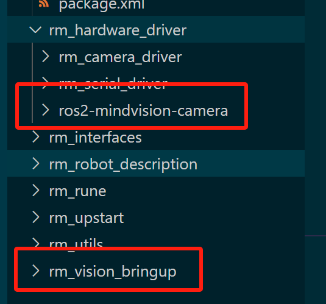
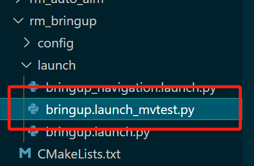

# 基础环境部署
## 1. 安装Ubuntu 22.04 LTS
注意看好版本

## 2. fishros安装ros2 humble

```
wget http://fishros.com/install -O fishros && . fishros
sudo apt-get install ros-humble-image-transport-plugins
sudo apt install ros-humble-asio-cmake-module
sudo apt install ros-humble-foxglove-bridge
sudo apt install ros-humble-serial-driver
sudo apt remove brltty
```

一切安装进行完毕后，运行一次

```
sudo apt update && sudo apt upgrade
```


## 3. 编译安装CH341驱动

下载ch341驱动

https://www.wch.cn/download/CH341SER\_LINUX\_ZIP.html

uname -r获取linux内核版本

下载对应内核版本的ch341.c

https://elixir.bootlin.com/linux/v6.8/source/drivers/usb/serial/ch341.c

替换文件夹内ch341.c文件

进入driver文件夹

make

如果提示没有gcc-12，使用apt安装gcc-12

sudo make install

如果提示insmod: ERROR: could not insert module ch341.ko: Unknown symbol in module

进行

modinfo ch341.ko |grep depends
depends:        usbserial

然后sudo modprobe usbserial

问题应该解决

验证：lsmod | grep ch34
ch341                  24576  0
usbserial              69632  1 ch341


## 4. 部署君瞄

拿到ros2程序包src文件夹，创建以兵种名称命名的文件夹，将src文件夹放入其中，在src上层运行

```
rosdepc update
rosdepc install --from-paths src --ignore-src -r -y
colcon build --symlink-install
```


## 5. 添加串口&相机的权限规则

sudo cp camera.rules  /etc/udev/rules.d/

sudo cp serial.rules  /etc/udev/rules.d/

添加后要重启生效


## 6. 启动相机节点

使用USB连接相机

在工作文件夹运行

source install/setup.bash

👆记得这个命令每次新建终端都要执行一次

ros2 run mindvision\_camera mindvision\_camera\_node

ros2 run armor\_detector armor\_detector\_node

rqt添加

Plugins->Visualization->Image View

Plugins->Configurations->Dynamic Reconfigure

rqt没找到话题和节点记得点刷新


## 7. 启动识别节点调试

rqt选择/armor\_detector节点配置，打开debug选项，可在左侧image view看到/detector/result\_img

调整相机对焦和光圈，使其能识别出装甲板且置信度稳定于98%-99%之间


## 8. 合并迈德威视相机节点

将我们的ros2-mindvision-camera和rm\_vision\_bringup如图拷贝至目录下



将bringup.launch\_mvtest.py拷贝至rm\_bringup节点对应目录下

**注意分辨rm\_vision\_bringup和rm\_bringup两个不同的名字**



照常编译并source，使用以下命令启动迈德威视相机搭配中南的后端程序：

```
ros2 launch rm_bringup bringup.launch_mvtest.py
```


# 中南新代码部署
## 1.编译时若提示cmake版本过低，可按如下文章方法安装cmake 3.24

https://blog.csdn.net/tanmx219/article/details/123495065

主要是

chmod + x cmake-3.22.0-linux-x86\_64.sh

sudo ./cmake的sh文件 --skip-license --exclude-subdir --prefix=/usr/local

这两句

cmake官网https://cmake.org/files/

## 2.其他库按照readme安装

## 3.安装spdlog库，版本1.14

```
git clone https://github.com/gabime/spdlog.git
cd spdlog && mkdir build && cd build
cmake .. && make -j
sudo make install
```
如编译g2o出现关于该库的报错，按照错误提示在CmakeCache里面添加-fPIC选项
## 4.FMT库存在重大依赖问题，需按照如下方式修复

修改armor\_detector节点里armor\_detector.cpp的代码，在include里添加#include \<fmt/format.h>

下载fmt10.2.1，按如下步骤编译安装：

修改CMakeLists.txt，在指定位置添加如下行：

```
Add -fPIC option
add_compile_options(-fPIC)
```


cd进去执行：

mkdir build && cd build
cmake ..
make
sudo make install

然后编辑build/CMakeCache.txt，在此处添加如下参数


然后重新在build目录执行：

make

sudo make install

如此，编译应该通过

## 5.g2o编译性能过差卡死解决方案

将make -j改为make -j4

任何时候遇到编译性能问题都可如此尝试

## 6.Ceres-Solver安装
rosdep提示缺少ceres是正常现象不必理会，确保apt中ceres的版本为2.0.0
## 7.OpenVINO部署

选[Go to the latest documentation for up-to-date information](https://docs.openvino.ai/)导航至最新版本

选择[Install OpenVINO](https://docs.openvino.ai/2024/get-started/install-openvino.html)

* [OpenVINO Runtime on Linux](https://docs.openvino.ai/2024/get-started/install-openvino/install-openvino-linux.html)
  * [Use APT](https://docs.openvino.ai/2024/get-started/install-openvino/install-openvino-apt.html#)

```
wget https://apt.repos.intel.com/intel-gpg-keys/GPG-PUB-KEY-INTEL-SW-PRODUCTS.PUB
sudo apt-key add GPG-PUB-KEY-INTEL-SW-PRODUCTS.PUB
echo "deb https://apt.repos.intel.com/openvino/2024 ubuntu22 main" | sudo tee /etc/apt/sources.list.d/intel-openvino-2024.list
sudo apt update
sudo apt install openvino
```


## 8.串口协议调试

## 9.描述模型尺寸修改
右手系，相机镜片平面中心与云台转动轴中心的相对位置
