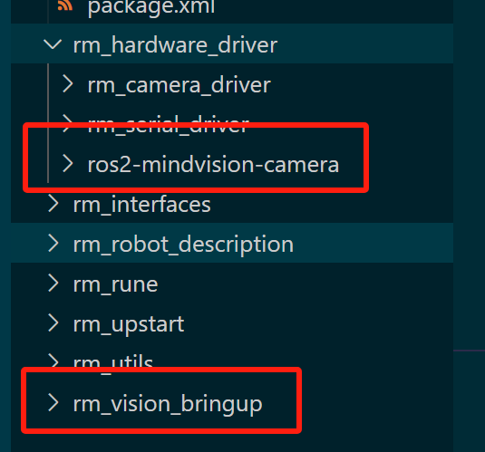
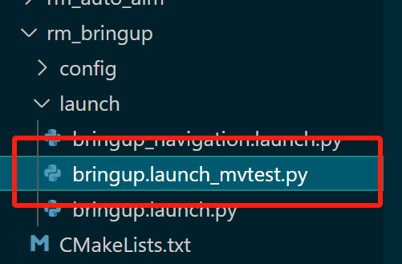
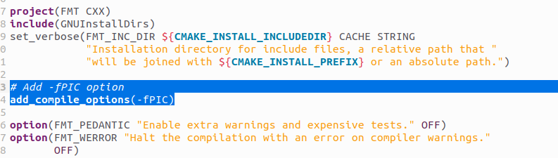
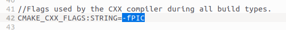

# SPR2025 Vision Project

中国石油大学SPR战队25赛季视觉项目主仓库

完全基于中南大学2024年视觉开源，很遗憾我们的开发规模不足以支持对现有的系统再做出除内部适配外更多的改动😢

该项目在原rm_vision项目上扩展了自瞄选板、能量机关识别与预测、哨兵定位、自主导航等功能，为RoboMaster机器人实现了一套通用的算法框架

你可以根据以下指引配置环境：
# 基础环境部署
## 1. 安装Ubuntu 22.04 LTS
注意看好版本

## 2. fishros安装ros2 humble

```
wget http://fishros.com/install -O fishros && . fishros
sudo apt-get install ros-humble-image-transport-plugins
sudo apt install ros-humble-asio-cmake-module
sudo apt install ros-humble-foxglove-bridge
sudo apt install ros-humble-serial-driver
sudo apt remove brltty
```

一切安装进行完毕后，运行一次

```
sudo apt update && sudo apt upgrade
```


## 3. 编译安装CH341驱动

下载ch341驱动

https://www.wch.cn/download/CH341SER\_LINUX\_ZIP.html

uname -r获取linux内核版本

下载对应内核版本的ch341.c

https://elixir.bootlin.com/linux/v6.8/source/drivers/usb/serial/ch341.c

替换文件夹内ch341.c文件

进入driver文件夹

make

如果提示没有gcc-12，使用apt安装gcc-12

sudo make install

如果提示insmod: ERROR: could not insert module ch341.ko: Unknown symbol in module

进行

modinfo ch341.ko |grep depends
depends:        usbserial

然后sudo modprobe usbserial

问题应该解决

验证：lsmod | grep ch34
ch341                  24576  0
usbserial              69632  1 ch341


## 4. 部署君瞄

拿到ros2程序包src文件夹，创建以兵种名称命名的文件夹，将src文件夹放入其中，在src上层运行

```
rosdepc update
rosdepc install --from-paths src --ignore-src -r -y
colcon build --symlink-install
```


## 5. 添加串口&相机的权限规则

sudo cp camera.rules  /etc/udev/rules.d/

sudo cp serial.rules  /etc/udev/rules.d/

添加后要重启生效


## 6. 启动相机节点

使用USB连接相机

在工作文件夹运行

source install/setup.bash

👆记得这个命令每次新建终端都要执行一次

ros2 run mindvision\_camera mindvision\_camera\_node

ros2 run armor\_detector armor\_detector\_node

rqt添加

Plugins->Visualization->Image View

Plugins->Configurations->Dynamic Reconfigure

rqt没找到话题和节点记得点刷新


## 7. 启动识别节点调试

rqt选择/armor\_detector节点配置，打开debug选项，可在左侧image view看到/detector/result\_img

调整相机对焦和光圈，使其能识别出装甲板且置信度稳定于98%-99%之间


## 8. 合并迈德威视相机节点

将我们的ros2-mindvision-camera和rm\_vision\_bringup如图拷贝至目录下



将bringup.launch\_mvtest.py拷贝至rm\_bringup节点对应目录下

**注意分辨rm\_vision\_bringup和rm\_bringup两个不同的名字**



照常编译并source，使用以下命令启动迈德威视相机搭配中南的后端程序：

```
ros2 launch rm_bringup bringup.launch_mvtest.py
```


# 代码部署
## 1.编译时若提示cmake版本过低，可按如下文章方法安装cmake 3.24

https://blog.csdn.net/tanmx219/article/details/123495065

主要是

chmod + x cmake-3.22.0-linux-x86\_64.sh

sudo ./cmake的sh文件 --skip-license --exclude-subdir --prefix=/usr/local

这两句

cmake官网https://cmake.org/files/

## 2.其他库按照readme安装

## 3.安装spdlog库，版本1.14

```
git clone https://github.com/gabime/spdlog.git
cd spdlog && mkdir build && cd build
cmake .. && make -j
sudo make install
```
如编译g2o出现关于该库的报错，按照错误提示在CmakeCache里面添加-fPIC选项
## 4.FMT库存在重大依赖问题，需按照如下方式修复

修改armor\_detector节点里armor\_detector.cpp的代码，在include里添加#include \<fmt/format.h>

下载fmt10.2.1，按如下步骤编译安装：

修改CMakeLists.txt，在指定位置添加如下行：

```
Add -fPIC option
add_compile_options(-fPIC)
```



cd进去执行：

mkdir build && cd build
cmake ..
make
sudo make install

然后编辑build/CMakeCache.txt，在此处添加如下参数



然后重新在build目录执行：

make

sudo make install

如此，编译应该通过

## 5.g2o编译性能过差卡死解决方案

将make -j改为make -j4

任何时候遇到编译性能问题都可如此尝试

## 6.Ceres-Solver安装
rosdep提示缺少ceres是正常现象不必理会，确保apt中ceres的版本为2.0.0
## 7.OpenVINO部署

选[Go to the latest documentation for up-to-date information](https://docs.openvino.ai/)导航至最新版本

选择[Install OpenVINO](https://docs.openvino.ai/2024/get-started/install-openvino.html)

* [OpenVINO Runtime on Linux](https://docs.openvino.ai/2024/get-started/install-openvino/install-openvino-linux.html)
  * [Use APT](https://docs.openvino.ai/2024/get-started/install-openvino/install-openvino-apt.html#)

```
wget https://apt.repos.intel.com/intel-gpg-keys/GPG-PUB-KEY-INTEL-SW-PRODUCTS.PUB
sudo apt-key add GPG-PUB-KEY-INTEL-SW-PRODUCTS.PUB
echo "deb https://apt.repos.intel.com/openvino/2024 ubuntu22 main" | sudo tee /etc/apt/sources.list.d/intel-openvino-2024.list
sudo apt update
sudo apt install openvino
```


## 8.串口协议调试

## 9.描述模型尺寸修改
右手系，相机镜片平面中心与云台转动轴中心的相对位置

# 以下是原项目仓库中的部署指南：
## 一、项目结构

*表示不在本仓库中直接提供，这部分模块已在[CSU-RM-Sentry](https://github.com/baiyeweiguang/CSU-RM-Sentry)开源

```
.
│
├── rm_bringup (启动及参数文件)
│
├── rm_robot_description (机器人urdf文件，坐标系的定义)
│
├── rm_interfaces (自定义msg、srv)
│
├── rm_hardware_driver
│   ├── livox_ros_driver2 (*Livox激光雷达驱动)
│   │
│   ├── rm_camera_driver (相机驱动)
│   │
│   └── rm_serial_driver (串口驱动)
│
├── rm_auto_aim (自瞄算法)
│
├── rm_rune (打符算法)
│
├── rm_localization (*定位算法)
│
├── rm_perception (*感知算法)
│
├── rm_navigation (*导航算法)
│
├── rm_decision (*自主决策算法)
│
├── rm_utils (工具包) 
│   ├── math (包括PnP解算、弹道补偿等)
│   │
│   └── logger (日志库)
│
└── rm_upstart (自启动配置)
```

## 二、环境

如果你不需要完整功能，可以直接把相关的功能包删除掉

### 1. 基础
- Ubuntu 22.04
- ROS2 Humble
- Mindvision相机驱动

### 2. 自瞄 
- fmt库
  ```bash
  sudo apt install libfmt-dev
  ```
- Sophus库 (G2O库依赖)
   ```bash
   git clone https://github.com/strasdat/Sophus
   cd Sophus
   mkdir build && cd build
   cmake ..
   make -j
   sudo make install
   ```
- G2O库 (优化装甲板Yaw角度)
    ```bash
    sudo apt install libeigen3-dev libspdlog-dev libsuitesparse-dev qtdeclarative5-dev qt5-qmake libqglviewer-dev-qt5
    git clone https://github.com/RainerKuemmerle/g2o
    cd g2o
    mkdir build && cd build
    cmake ..
    make -j
    sudo make install
    ```
### 3. 能量机关
- OpenVINO库 (能量机关识别)
  
   参考[OpenVINO官方文档](https://docs.openvino.ai/2022.3/openvino_docs_install_guides_installing_openvino_from_archive_linux.html)，建议同时安装GPU相关依赖

- Ceres库 (能量机关曲线拟合)
    ```bash
    sudo apt install libceres-dev
    ```

### 4. 导航
- Livox SDK2

  参考[Livox官方仓库](https://github.com/Livox-SDK/Livox-SDK2)

- Navigation2 (导航)
    ```bash
    sudo apt install ros-humble-navigation2 ros-humble-nav2-bringup
    ```

- PCL库 (导航时对点云的处理)
    ```
    sudo apt install libpcl-dev
    ```

### 5. 其他

本文档中可能有缺漏，如有，可以用`rosdep`安装剩下依赖

```bash
rosdep install --from-paths src --ignore-src -r -y

```

## 三、编译与运行

修改rm_bringup/config/launch_params.yaml，选择需要启动的功能

```bash
# 编译
colcon build --symlink-install --parallel-workers 4 #本仓库包含的功能包过多，建议限制同时编译的线程数
# 运行
source install/setup.bash
ros2 launch rm_bringup bringup.launch.py
```

默认日志和内录视频路径为`~/fyt2024-log/`

> 我们的日志库是用fmt搓的，不使用ros2的日志库


## 四、自启动

- 编译程序后，进入rm_upstart文件夹

```bash
cd rm_upstart
```

- 修改**rm_watch_dog.sh**中的`NAMESPACE`（ros命名空间）、`NODE_NAMES`（需要看门狗监控的节点）和`WORKING_DIR` （代码路径）

- 注册服务
  
```bash
sudo chmod +x ./register_service.sh
sudo ./register_service.sh

# 正常时有如下输出
# Creating systemd service file at /etc/systemd/system/rm.service...
# Reloading systemd daemon...
# Enabling service rm.service...
# Starting service rm.service...
# Service rm.service has been registered and started.
```

- 查看程序状态

```bash
systemctl status rm
```

- 查看终端输出
```
查看screen.output或~/fyt2024-log下的日志
```  

- 关闭程序

```bash
systemctl stop rm
```

- 取消自启动

```bash
systemctl disable rm
```

## 维护者及开源许可证

> 赛季结束开源

Maintainer : FYT Vision Group

```
Licensed under the Apache License, Version 2.0 (the "License");
you may not use this file except in compliance with the License.
You may obtain a copy of the License at

    http://www.apache.org/licenses/LICENSE-2.0

Unless required by applicable law or agreed to in writing, software
distributed under the License is distributed on an "AS IS" BASIS,
WITHOUT WARRANTIES OR CONDITIONS OF ANY KIND, either express or implied.
See the License for the specific language governing permissions and
limitations under the License.
```

## 致谢

感谢这个赛季视觉组的每一个成员的付出，感谢以下开源项目：

- [rm_vision](https://gitlab.com/rm_vision) rv是本项目的基础，提供了一套可参考的，规范、易用、高效的视觉算法框架
- [rmoss](https://github.com/robomaster-oss/rmoss_core) rmoss项目为RoboMaster提供通用基础功能模块包，本项目的串口驱动模块基于rmoss_base进行开发
- [沈阳航空航天大学TUP战队2022赛季步兵视觉开源](https://github.com/tup-robomaster/TUP-InfantryVision-2022) 为本项目的能量机关识别与预测算法提供了参考
- [沈阳航空航天大学YOLOX关键点检测模型](https://github.com/tup-robomaster/TUP-NN-Train-2) 提供了本项目能量机关识别模型训练代码
- [四川大学OpenVINO异步推理代码](https://github.com/Ericsii/rm_vision-OpenVINO) 提供了本项目能量机关识别模型部署的代码
- [上海交通大学自适应扩展卡尔曼滤波](https://github.com/julyfun/rm.cv.fans/tree/main) 使用Ceres自动微分功能，自动计算Jacobian矩阵


## 更新日志

- 参考上交开源，实现了EKF的自动求Jacobian矩阵
- 增加了粒子滤波器，为状态估计提供新的选择
- 修复了打符崩溃的问题（OpenVINO在推理时不能创建新的InferRequest，通过互斥锁解决）
- 将自瞄解算修改为定时器回调，固定解算的频率
- 增加手动补偿器ManualCompensator
- 重写PnP选解逻辑
- 修改了BA优化的代码，抽象出新的类ArmorPoseEstimator
- 为中国石油大学SPR机器人队代码做了适应性部署