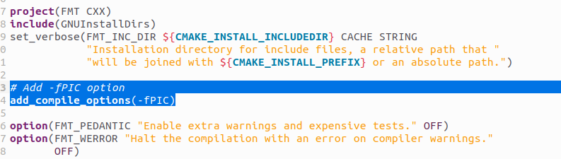
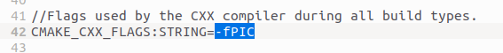

# 中国石油大学（北京）SPR战队 RoboMaster2026赛季 视觉自瞄系统

基于rmvision项目、中南大学、深圳大学视觉开源
贡献者&维护者：SPR算法组 张苏杭 张容溪 王宏达 唐京

# 各兵种针对部署备忘录
各台车的相机内参以及相机-云台变换尺寸均需要针对实际进行修改

# 全流程部署指南

## 1. 安装Ubuntu 22.04 LTS
强烈建议安装时选择Minimal Installation，可以少点没用的东西。

## 2. 通过fishros一键安装ros2 humble desktop以及rosdepc
```
wget http://fishros.com/install -O fishros && . fishros
```

## 3.使用一键安装脚本部署
```
chmod +x install_and_configure.sh
./install_and_configure.sh
```

## 4.运行SPR-Vision
首次运行前在Main_ws运行
```
rosdepc update
rosdepc install --from-paths src --ignore-src -r -y
```
然后进行编译
```
colcon build --symlink-install --parallel-workers 4
```
之后按照如下方式启动：
```
source install/setup.bash
ros2 launch rm_bringup bringup.launch.py
```
若遇到类似Something went wrong while looing up transform之类的串口通信问题，按照
检查硬件连接->CuteCom检查串口接收通信工作情况->检查数据校验是否成功
的步骤，依次检查与下位机的通信情况

CMake Error at /opt/ros/humble/share/rosidl_cmake/cmake/rosidl_generate_interfaces.cmake:240 (list):
list index: 1 out of range (-1, 0)
的问题，则表示路径中有非Unicode字符，将工作目录移动至无中文路径中删除build重新编译。

若遇到类似error while loading shared libraries: libg2o_core.so: cannot open shared object file
等g2o库等无法找到的问题，首先确保g2o已按照-fPIC参数正确编译并安装成功，若问题仍然存在，则使用如下命令编辑该文件：
sudo gedit /etc/ld.so.conf
并在文本编辑器中添加如下行：
/usr/local/lib
保存并退出，运行
sudo ldconfig
如此，问题应该解决。
原文链接：https://blog.csdn.net/weixin_38258767/article/details/106875766


## 5. 启动相机节点与调试环境设置与相机标定
标定板PDF生成网站：
https://calib.io/pages/camera-calibration-pattern-generator
注意打印时一定要避免因打印页面缩放导致的尺寸误差！

使用USB连接相机

在工作文件夹运行

source install/setup.bash

👆记得这个命令每次新建终端都要执行一次

ros2 run mindvision\_camera mindvision\_camera\_node

rqt添加

Plugins->Visualization->Image View

Plugins->Configurations->Dynamic Reconfigure

若没找到话题和节点记得点刷新

### 标定部分
安装
```
sudo apt install ros-humble-camera-calibration
```
然后运行
```
ros2 run camera_calibration cameracalibrator --size 7x10 --square 0.03 image:=/image_raw camera:=/mv_camera
```
注意，标定板的规格与尺寸大小需要根据实际情况做出相应修改!
按照进度条指示完全移动标定板，尽量使进度条变满，差不多后点击Calibrate；
计算完成后点击Save，结果文件位于/tmp/calibrationdata.tar.gz

## 6. 单独启动识别节点调试
```
ros2 run armor\_detector armor\_detector\_node
```
rqt选择/armor\_detector节点配置，打开debug选项，可在左侧image view看到/detector/result\_img

调整相机对焦和光圈，使其能识别出装甲板且置信度稳定在100%左右

## 7.串口协议通信调试
所有的数据包均统一为16位的FixPacket，其中帧头0xFF，帧尾0xFE；
发送给电控格式为：帧头0xFF，开火（1字节），Yaw（4字节），Pitch（4字节），Distance（4字节），留空（1字节），帧尾0xFE
从电控接收格式为：帧头0xFF，颜色（1字节），填充（2字节）Pitch（4字节），Yaw（4字节），帧尾0xFE，留空（3字节）
遇到通信错误导致

## 8.云台-相机描述模型尺寸修改
右手系，相机镜片平面中心与qiangguan转动轴中心的相对位置，根据兵种情况修改xyz

## 以下为手动安装方法，一键安装脚本遇到问题时，可单独对照进行debug

### 编译安装CH341驱动并配置串口
```
sudo apt remove brltty
```

下载并按照压缩包内readme配置串口驱动

如果提示没有gcc-12，使用apt安装gcc-12
如果提示insmod: ERROR: could not insert module ch341.ko: Unknown symbol in module

则进行
```
modinfo ch341.ko |grep depends
depends:        usbserial
```
然后
```
sudo modprobe usbserial
```
问题应该解决

安装完成后验证：
```
lsmod | grep ch34
ch341                  24576  0
usbserial              69632  1 ch341
```

### 安装spdlog库（版本1.14）
压缩包解压后cd进去
```
mkdir build && cd build
cmake .. && make -j4
sudo make install
```
cmake之后如下方fmt一样，在CmakeCache.txt里面添加-fPIC选项

### 安装FMT库（版本10.2.1）
(已完成)修改armor\_detector节点里armor\_detector.cpp的代码，在include里添加#include \<fmt/format.h>

压缩包解压后cd进去

修改CMakeLists.txt，在指定位置添加如下行：
```
#Add -fPIC option
add_compile_options(-fPIC)
```



cd进去执行：
```
mkdir build && cd build
cmake ..
make
sudo make install
```
然后编辑build/CMakeCache.txt，在此处添加如下参数



然后重新在build目录执行：
```
make
sudo make install
```
如此，编译应该通过

### 安装g2o库（版本20230806_git）
压缩包解压后cd进去
```
mkdir build && cd build
cmake .. && make -j4
sudo make install
```
性能过差卡死解决方案：将make -j改为make -j4或更小的数字，任何时候遇到编译性能问题都可如此尝试

编译时同样需要添加-fPIC选项！

### 安装Ceres-Solver库（版本2.0.0）（可能2.2.0）
压缩包解压后cd进去
```
mkdir build && cd build
cmake .. && make -j4
sudo make install
```
rosdep提示缺少ceres是正常现象不必理会，确保apt中libceres的版本为2.0.0
若编译中Cmake提示找不到tbb相关文件，则卸载当前的libtbb，并按顺序安装libtbb2，libtbb2-dev，libtbbmalloc2-dev

### 添加串口&相机的权限规则
```
sudo cp camera.rules  /etc/udev/rules.d/
sudo cp serial.rules  /etc/udev/rules.d/
```
添加后重启生效

### 安装OpenVINO
web搜索Install OpenVINO，选择介于2022-2024之间的版本，Distribution选择APT方式，并按照官网指示完成安装。
